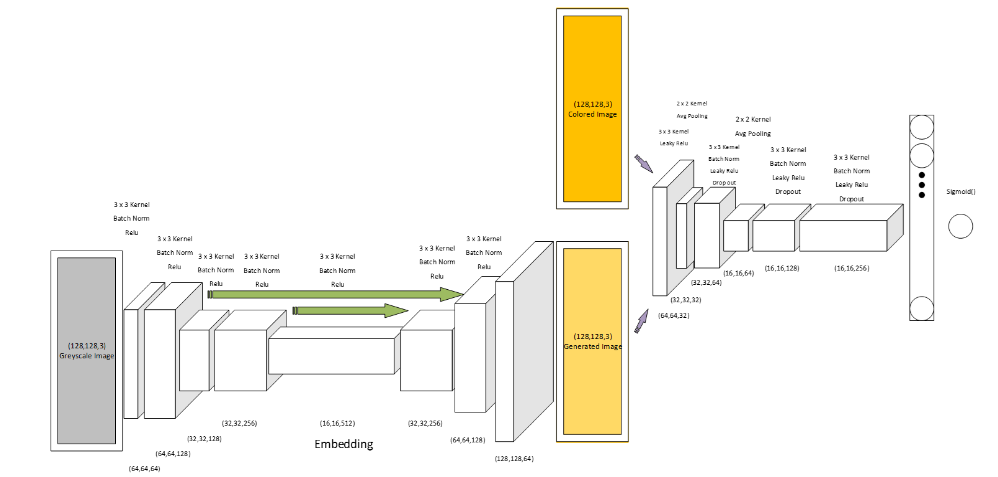

# Colorizing-Images

The goal of the project was to design a machine learning model that can clorize grayscale images in a plausible manner. In order to simplify the complexity of the images while allowing for a broad range of colours, the model was trained on grayscale/RGB pairs of flower images. The training data can be seen in the flower images.zip file.

# Final Model Architecture

In this project we iterated on different model (CNN, Autoencoders and GANs) and the final architecture is a GAN with a convolutional neural network (CNN) as discriminator and Autoencoder as the generator. 

Downsampling is achieved using a stride of 2 in the encoder’s convolutional layers. Poolings are not used due to their impact on the stability of GAN. Each encoder layer except the first doubles the number of feature maps and batch normalizes the output. An embedding dimension of (16, 16, 512) is produced. Upsampling is achieved using a combination of skip connections and transposed convolutional layers. The ResNet style skip connection in conjunction with ReLU activation are implemented.

The layout of the final GAN architecture can be seen below:

Due to the fragile stability of GAN, regularization methods in both the architecture and the training function are non-trivial. In the training function, a threshold accuracy for the discriminator is set such that the discriminator is not trained when the accuracy is above the threshold. Noises are fed to the discriminator every 5th epoch to improve its generalizing capacity. The loss of the generator is modified to be a combination of binary cross entropy loss from the flipped labels and L1 loss from the original colored images.

